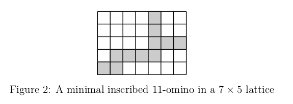

# Enumeration of Minimal Inscribed Polyforms

A [polyomino](https://en.wikipedia.org/wiki/Polyomino) of area $n$ is a shape formed in the plane constructed by joining $n$ unit squares called *cells* along their edges. A domino is the case $n=2$. Polyominos of area $n$ are often refered to as $n$-ominos. 

The difficulty in enumerating polyominos has lead many to the study of polyomino families. Polyomino families add constraints on polyomino construction to introduce additional structure. One such family is the *minimal inscribed polyominos.* 

A polyomino is *minimal inscribed* when it is contained in a $w \times \ell$ rectangular lattice, where each of the four sides of the rectangle is touched by a cell of the polyomino, and the polyomino is of minimal area $w + \ell - 1.$

How many minimal inscribed polyominos are there for a given $w \times \ell$ lattice? 

Setting $w=\ell$ and starting at $w=1$ gives

$$1, 4, 25, 120, 497, 1924\dots$$
This sequence is [A334551](https://oeis.org/A334551) in the OEIS.

[Goupil, Cloutier, and Noubound](https://www.researchgate.net/publication/281299307_Enumeration_of_inscribed_polyominos) showed that if $s_{w,\ell}$ is the number of minimal inscribed polyominos in a $w \times \ell$ grid, then

$$s_{w,\ell}=8\binom{w+\ell-2}{w-1} -3w\ell + 2w +2\ell-8.$$

This project introduces a novel proof of this result. 

This project also generalizes this family to *polyforms*, a generalization of polyominos to unit polygons. Finally, this project provides enumeration results on a number of these generalizations. 

A summary of these results can be found at `/summary/summary.pdf` while the proofs of these results can be found in the `/minnesota-sub/mjumsubmission.pdf`. Additionally, two of the results can be found on the OEIS, namely Theorem 2 is [A356888](https://oeis.org/search?q=A356888&language=english&go=Search) and Theorem 5 is [A356889](https://oeis.org/search?q=A356889&language=english&go=Search).

A video summary of this project can be found NOT DONE.

Finally, the enumeration of the extended aztec diamond case was completed after the completion of the thesis and submittal to the Minnesota Journal of Undergraduate Mathematics, so the work for this portion is included seperately in the `aztec` directory. 